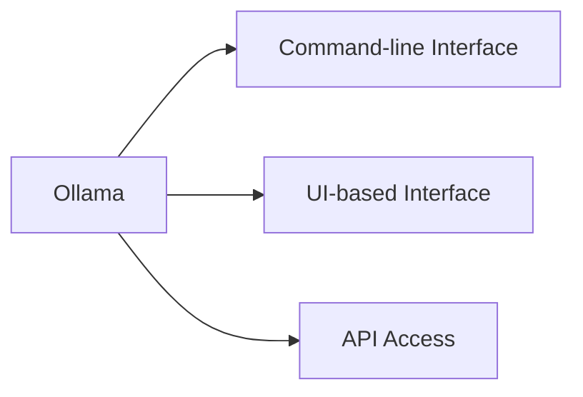

# ollama

Ollama란 대규모 언어 모델(Large Language Model, LLM)을 로컬 환경에서 쉽게 실행하고 관리할 수 있도록 설계된 오픈소스 플랫폼 및 도구입니다. Ollama는 Windows, macOS, Linux 같은 다양한 운영체제에서 설치 및 실행할 수 있으며, Llama, Gemma, Mistral, DeepSeek 등 다양한 LLM을 지원합니다. 또한 REST API로 다른 애플리케이션과의 연동도 지원합니다.

## Ollama의 특징

로컬 실행

인터넷 연결 없이 로컬 환경에서 LLM을 사용할 수 있습니다.

다양한 모델 지원

Ollama는 Llama, Gemma, Mistral, DeepSeek 등 다양한 LLM을 지원합니다.

간단한 설치 및 사용

CLI를 통해 쉽게 설치 및 실행할 수 있습니다.

REST API 제공

Ollama는 REST API를 제공하여 LLM을 다른 애플리케이션과 쉽게 연동할 수 있도록 지원합니다.

모델 커스터마이징 지원

GGUF(Georgi Gerganov Unified Format) 형태의 모델을 임포트하거나 사용자 지정 모델을 학습시킬 수 있습니다.



- RAG: Retrieval-Augmented Generation
  - Converse with our own documents/data
  - solves hallucination issue

LangChain: A tool that makes it really easy to deal with LLMs and build robust LLM applications

```
pip install -r requirements.tsx
```
